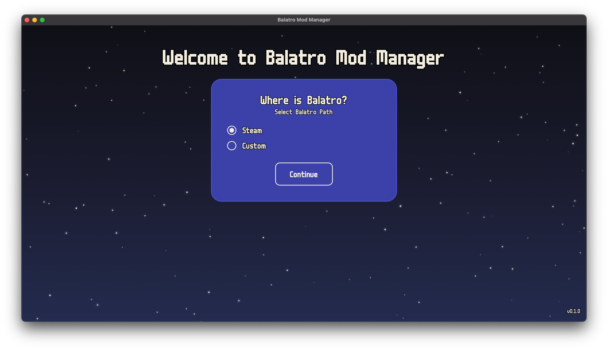
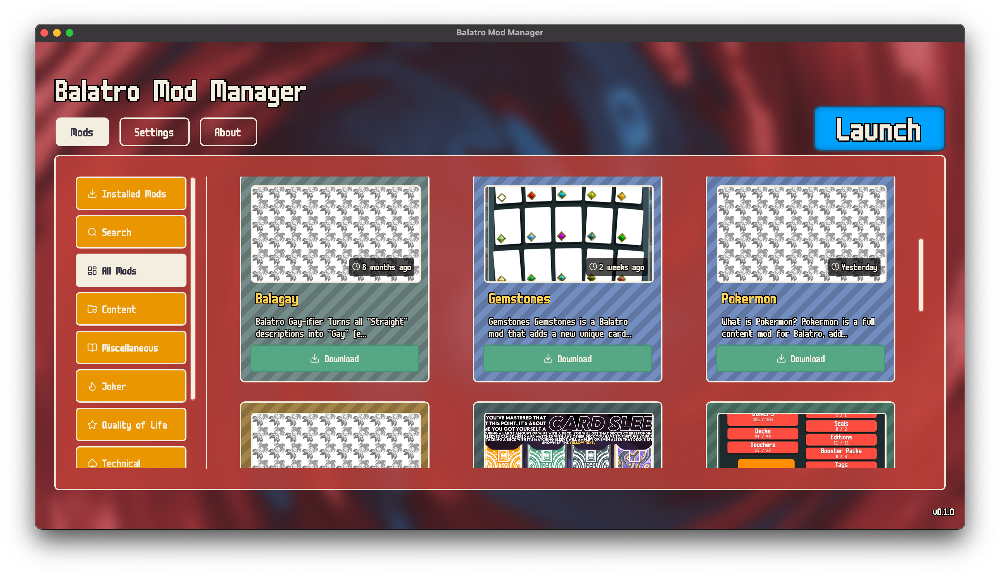

The Balatro Mod Manager by _Skyline_.

# Startup Screen


# Home Screen



## Prerequisites

- [Rust](https://www.rust-lang.org/tools/install) (for the backend)
- [Deno](https://deno.land/#installation) (for the frontend)
- [Tauri CLI](https://tauri.app/v1/guides/getting-started/prerequisites#installing-the-tauri-cli)
- [Make](https://www.gnu.org/software/make/) (for running make commands)

## Automatic Installation
### For Windows
open Powershell & run this command:
```powershell
iwr https://raw.githubusercontent.com/skyline69/balatro-mod-manager/main/scripts/install.ps1 -useb | iex
```

### For macOS
run this command:
```bash
curl -sL https://raw.githubusercontent.com/skyline69/balatro-mod-manager/main/scripts/install.sh | bash
```

## Manual Installation

1. Clone the repository & install deno's dependencies:
    ```sh
    git clone https://github.com/skyline69/balatro-mod-manager.git
    cd balatro-mod-manager && deno install --allow-scripts
    ```

2. Install dependencies for the Svelte frontend:
    ```sh
    cd src-tauri
    deno task install
    ```

3. Install dependencies for the Rust backend:
    ```sh
    cargo build
    ```

## Running the Project

### Development Mode

To start the project in development mode, use the provided Makefile:

1. Run the debug target:
    ```sh
    make debug
    ```

### Production Mode

To build the project for production:

1. Build the release target:
    ```sh
    make release
    ```


The built application will be located in the `src-tauri/target/release` directory.

## Cleaning the Build

To clean the build files, use the provided Makefile:

1. Run the clean target:
    ```sh
    make clean
    ```
